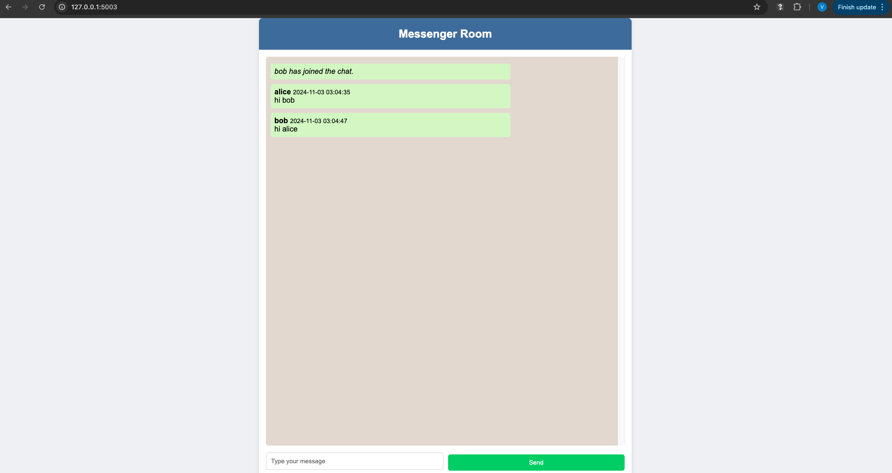

# Flask Real-Time Chat Application

This is a real-time chat application built with Flask, Flask-SocketIO, and SQLite. Users can join chat rooms, send messages, and view message history in real-time. The app features a simple and responsive UI that provides a smooth chat experience.

## Features

- Real-time messaging with WebSocket support using Flask-SocketIO
- Chat rooms with unique room names
- Message history saved in SQLite database
- Responsive and clean UI
- Python `.env` file support for secure configurations

## Project Structure

```
flask_chat_mvc/
├── app.py                  # Main application entry point
├── config.py               # Configuration settings
├── models.py               # Database models
├── controllers/
│   └── chat_controller.py  # Controller for handling routes and socket events
├── templates/
│   └── chat_room.html      # HTML template for chat room
├── static/
│   └── styles.css          # CSS file for styling
└── __init__.py             # Flask app setup
```

## Getting Started

### Prerequisites

- Python 3.x
- Virtual environment (recommended)
- Git

### Installation

1. **Clone the Repository:**

   ```bash
   git clone https://github.com/yourusername/flask_real_chat_application.git
   cd flask_chat_mvc
   ```

2. **Create and Activate a Virtual Environment:**

   ```bash
   python3 -m venv venv
   source venv/bin/activate  # For Mac/Linux
   # venv\Scripts\activate    # For Windows
   ```

3. **Install Dependencies:**

   ```bash
   pip install -r requirements.txt
   ```


4. **Initialize the Database:**

   Run the following command to initialize the SQLite database:

   ```bash
   python app.py
   ```

   The application will create a file named `chat_history.db` in the project directory.

### Running the Application

1. **Start the Flask Application:**

   ```bash
   python app.py
   ```

2. **Access the Application:**

   Open a web browser and go to:

   ```
   Ex:  http://127.0.0.1:5003
   ```

3. **Join a Chat Room:**

   - Enter your username and a room name to join the chat.
   - You can open multiple tabs with the same room name to test real-time messaging.

### Using the Application

- **Join Chat Room:** Enter a username and room name, then click "Join Chat."
- **Send Messages:** Type messages in the input box and click "Send" to communicate in real-time.
- **Message History:** View previously sent messages within the room.

### Application Screenshots




## MVC Structure

In the **MVC (Model-View-Controller)** architecture, code is organized into three main components — Model, View, and Controller — each with a clear role in structuring the application. Here’s how each part is implemented and why this structure was chosen.

### 1. Model (M) - `models.py`

The **Model** manages the application’s data and business logic. In this project, it uses SQLAlchemy to interact with the SQLite database.

- **File: `models.py`**  
  - **`ChatMessage` Model**: This model defines how messages are stored in the database, with fields like `sender`, `content`, `timestamp`, and `room` (the chat room name). By creating this model, the application’s data is structured and organized in a single location, making it easier to manage and update.

  **Explanation**: Placing the data-related logic in `models.py` keeps it separate from the rest of the application. This setup means that if we need to modify the database structure or add new data fields, we can do so without affecting other parts of the code. This is essential for scalability and makes the application easier to maintain and expand in the future.

### 2. View (V) - `templates/chat_room.html` and `static/styles.css`

The **View** presents data to users and provides an interface for them to interact with the application.

- **Files**: `templates/chat_room.html` and `static/styles.css`
  - **`chat_room.html`**: This HTML file renders the chat room interface, allowing users to enter a username, room name, and message content. It also includes JavaScript for WebSocket connections, enabling real-time messaging without page refreshes.
  - **`styles.css`**: This CSS file styles the chat interface, making it user-friendly and visually appealing.

  **Explanation**: Separating the user interface components (HTML and CSS) into the `templates` and `static` folders aligns with Flask’s conventions, making the application more modular. This organization allows us to change the look and feel of the app without touching the backend code, which makes the UI easier to update, adjust, or extend.

### 3. Controller (C) - `controllers/chat_controller.py`

The **Controller** bridges the Model and the View, handling user input, interacting with the Model for data retrieval or updates, and sending information back to the View. This controller leverages Flask-SocketIO to manage WebSocket events for real-time chat functionality.

- **Key Functions in `chat_controller.py`**:
  - **`chat_home()`**: Loads the chat room page when users visit the main route (`/`).
  - **`handle_join()`**: Handles users joining a chat room, including retrieving past messages from the database and broadcasting join events.
  - **`handle_message()`**: Saves new messages to the database and broadcasts them to all users in the same chat room.
  - **`handle_leave()`**: Manages users leaving the chat room by broadcasting a “leave” notification.

  **Explanation**: Putting the WebSocket handling and routing logic in `chat_controller.py` keeps communication processes separate from data storage and the user interface. This separation creates a more modular structure that’s easier to expand if we want to add features, like additional event types or actions. It also ensures that routing and WebSocket handling are organized in one place, making the application more maintainable.

### Summary of the MVC Structure

- **Model (`models.py`)**: Manages all data-related logic. This separation is ideal for handling changes in data storage without affecting the UI or WebSocket handling.

- **View (`chat_room.html` and `styles.css`)**: Contains all the UI components, making it easy to adjust the user interface without impacting backend data handling. This organization keeps the app’s structure clean and well-organized.

- **Controller (`chat_controller.py`)**: Connects the Model and View by managing user requests and WebSocket events in a single location. This modular structure simplifies maintenance and keeps event handling distinct from data and UI logic.

Overall, this MVC structure was chosen for its modularity, maintainability, and scalability. It allows each part of the application to be developed and modified independently, ensuring a clean and adaptable codebase that can grow with future requirements.


## File Descriptions

- **app.py:** The main entry point of the application, where the server is run.
- **config.py:** Contains configuration settings for the Flask application.
- **models.py:** Defines the `ChatMessage` model for storing messages in the SQLite database.
- **controllers/chat_controller.py:** Contains the main route and WebSocket event handlers.
- **templates/chat_room.html:** The HTML file for the chat room interface.
- **static/styles.css:** CSS file to style the chat application.

## Technologies Used

- **Flask** - Micro web framework for Python
- **Flask-SocketIO** - Provides WebSocket support for real-time communication
- **Flask-SQLAlchemy** - Adds SQLAlchemy support to Flask for ORM
- **SQLite** - Lightweight database for message storage
- **HTML/CSS** - Frontend design and styling

